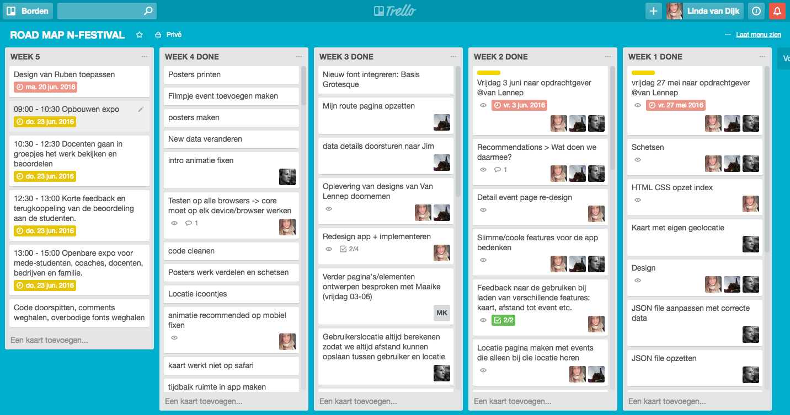
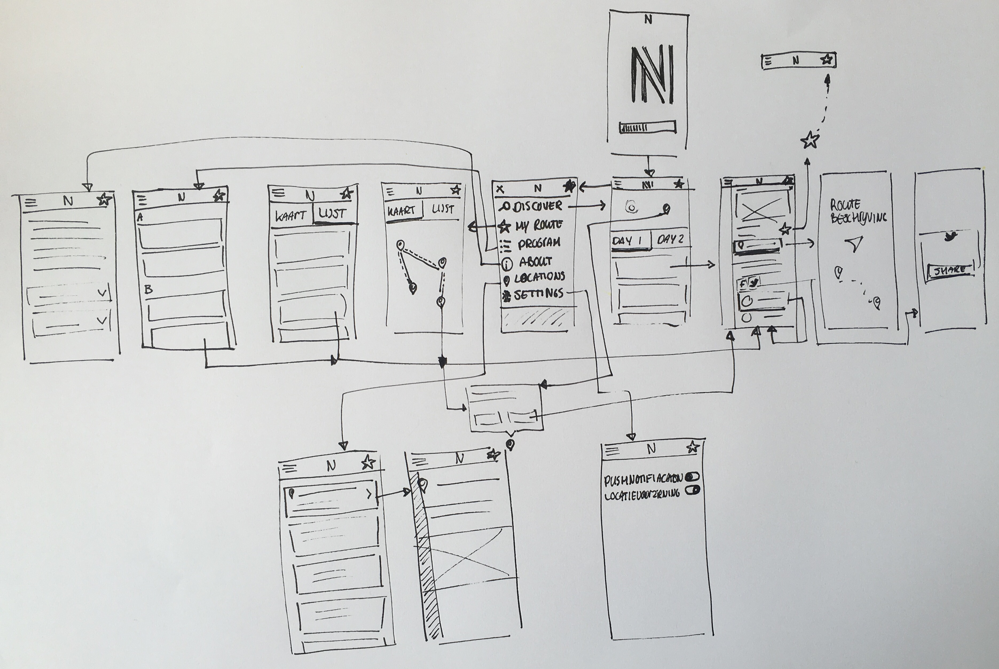
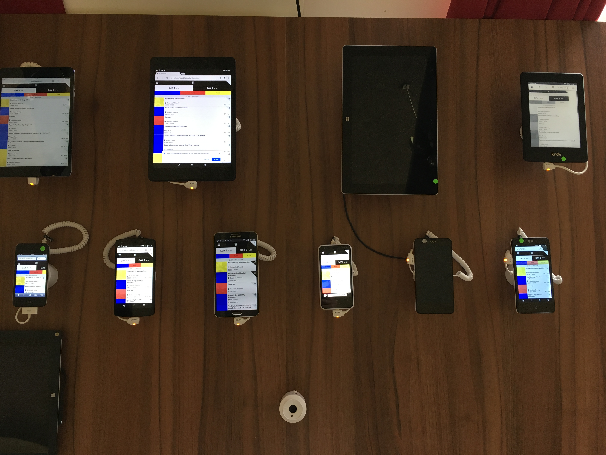

# N-Festival applicatie

> Deze repository is gevorked van: [https://github.com/tijsluitse/n-festival](https://github.com/tijsluitse/n-festival) waar we in hebben gewerkt tijdens gedurdende dit project. Alle aanpassingen zijn daarin te zien.

> ####Medewerkers:

> * Tijs Luitse - [https://github.com/tijsluitse](https://github.com/tijsluitse)
> * Lisa Klein - [https://github.com/sayLISA](https://github.com/sayLISA)
> * Linda van Dijk - [https://github.com/linda2912](https://github.com/linda2912)


## Live versie
[https://nfest.lisaklein.nl]()


## Wat is N-festival
Dit najaar vindt de eerste editie van N-Festival plaats: een community festival over innovatie, muziek en goed eten in Amsterdam-Noord. N-Festival wordt een jaarlijkse uitwisseling tussen New York en Amsterdam. Het beste uit beide steden wordt opgezocht en getoond: muziek, culinaire concepten, mode, media, robotica en nog veel meer.

## De opdracht
Een applicatie ontwikkelen voor de festivalgangers van het N-festival die zij tijdens het festival kunnen gebruiken. De opdrachtgever had de volgende Must haves en Could haves opgesteld:

#### Must haves

1. Als gebruiker wil ik kunnen lezen en begrijpen wat het N-Festival is en waar het voor staat 
2. Als gebruiker wil ik informatie over het festival zien, omdat ik bijvoorbeeld wil zien wanneer het festival plaatsvindt 
3. Als gebruiker wil ik kunnen zien welke partners verbonden zijn aan N-Festival en wil ik kunnen doorlinken naar hun website 
4. Als gebruiker wil ik een compleet programma kunnen zien, omdat ik wil weten wat er allemaal te doen is 
5. Als gebruiker wil ik een overzicht van alle locaties zien, omdat ik wil zien waar alles precies plaatsvindt 
6. Als gebruiker wil ik meer informatie over een evenement kunnen zien, omdat ik wil zien of ik het interessant vind. 
7. Als gebruiker wil ik zien wat er nu bezig is, zodat ik kan zien waar ik heen wil op het festival zelf 
7. Als gebruiker wil ik zien wat er hierna komt, zodat ik kan plannen waar ik heen wil 
8. Als gebruiker wil ik kunnen filteren op type evenement, omdat ik een helderder overzicht wil van het programma 
9. Als gebruiker wil ik kunnen filteren op locatie, zodat ik weet wat er om mij heen gebeurt 
10. Als gebruiker wil ik gemakkelijk naar de social netwerkkanalen van het N-Festival kunnen gaan en wil ik gemakkelijk op eigen kanalen kunnen posten over het N-Festival

#### Could haves

1. Als gebruiker wil ik verrast worden met een programmaonderdeel omdat ik nieuwe dingen wil ontdekken 
2. Als gebruiker wil ik een route kunnen uitstippelen, omdat ik me dan tijdens het festival geen zorgen meer hoef te maken over mijn programma
3. Als gebruiker wil ik een selectie kunnen zien van een curator, omdat ik me helemaal wil laten meenemen
4. Als gebruiker wil ik zelf mijn programma kunnen samenstellen en gemaakte keuzes online terug kunnen halen 
5. Als gebruiker wil ik kunnen zien waar het op dit moment druk is zodat ik eventueel mijn programma daarop kan afstemmen

##Technieken
* Express
* HTML 5 met Handlebars
* CSS
* Vanilla Javascript
* Gulp
* DigitalOcean

## Code structuur

```
app.js                  //In deze file begint de app
gulpfile.js
package.json
/bin
/node_modules           //De modules die gebruikt zijn
/public                 //De public folder bavat alle statische files zoals CSS, js en images
  /dist                 //De dist folder bevat de minified en prefixed CSS en js
    /css
    /js
    /lib
  /font                 //De fonts die we gebruiken
  /img                  //De images die we gebruiken
  /src                  //De src folder bevat de files waar we in werken die nog niet geminimaliseerd zijn
    /css
    /js                 //Client-side JS
    /lib
/routes
  index.js              //Hier worden alle routes gedefinieerd 
  /views                //Alle templates in handlebars
  /partials             //Bevat kleine stukken HTML die worden gebruiker in verschillende templates  

```

##Run the app
Om de app op je eigen computer te instaleren moet je deze repo clonen. Open vervolgens je terminal en ga naar hoofdmap van de app. Instaleer dan vervolgens eerst de node modules

``` 
npm install 
```

start de app

``` 
nodemon app.js 
```


#Project verloop

## Team
Ik heb dit project uitgevoerd samen met Lisa Klein en Tijs Luitse zodat wij een product konden neerzetten die direct gebruikt kan worden.

Tijdens het project heeft iedereen een beroepsrol op zich genomen. Lisa was de Back-end Developer, Tijs was de Front-end Developer en ik was de Front-end Designer.

## Taakverdeling
We hebben ervoor gekozen om taken op te delen door middel van features op te zetten in Trello en die te verdelen. Op deze manier geeft iedereen zijn bijdrage aan de vakken Web App From Scratch, Css To The Rescue, Browser Technologies en Performance Matters.



## Verwerking vakken van de minor

####Web App From Scratch
* Object oriented programming, we hebben files gestructureerd in verschillende modules en geprogrammeerd op de OOP manier.
* IIFE, Immediately- Invoked Function Expressions
* Javascript interacties, vloeiende transities: about naar menupagina scroll
* We halen data op uit een wordpress API, combineren data die we nodig hebben, filteren data op tijd en laden we in de app.
* Templating

####CSS To The Rescue
* Semantische CSS
* :target selectors
* CSS fallbacks voor viewheight, viewwidth etc.
* PE, app is bruikbaar zonder css, we 'hiden' elementen met javascript
* Flexbox
* Prefixes voor alle browsers

####Browser Technologies
* Semantische HTML
* CSS fallbacks voor viewheight, viewwidth etc.
* Progressive Enhanchement, feature detecties voor geolocatie, localstorage, helpers voor addEventListeners.
* App is bruikbaar gemaakt voor toetsenbord gebruikers.
* Core functionaliteiten werken zonder javascript, CSS andere onbevoegdheden door de node server.
* Enhanchement voor gebruikers met een hippe browser: animaties, google maps, geolocatie.

####Performance Matters
* Semantische HTML & CSS
* Gulp, minified js en CSS files voor een snellere laadtijd.
* Geoptimaliseerde http requests: Javascript files worden alleen geladen op de pagina's waar ze nodig zijn.

## Wat ik heb gedaan de afgelopen 5 weken
#### Week 1
* Schetsen van de app
* HTML en CSS opzet voor de index pagina
* Design voor de app

#### Week 2
* Wireframe

* Menu + werkend in css zonder js op iedere pagina
* Toevoegen aan mijn route button HTML en CSS animatie
* Programma pagina opzetten HTML CSS
* Filter systeem opzetten HTML CSS
* Locatie pagina maken events die alleen bij die locatie horen
* Feedback naar de gebruiker bij het laden van de kaart en de afstand tot een evenement.
* Detail evenement pagina re-desingen

#### Week 3
* Evenement delen via Soical Media
* Re-design app: Filter bar, header bar, Menu, Detail event
* Font integreren

#### Week 4
* Nieuwe menu ontwerp integreren HTML CSS
* Android browser bugs fixen HTML CSS
* Detail pagina’s (curator, locaties en programma) integreren HTML CSS
* Terug knop vanuit diepere pagina's
* Ontwerp kaart markers en locaties
* Ontwerp kaart pop-up CSS
* Fine-tuning design CSS
* Nieuws slideshow
* Fallback voor als er geen image wordt toegevoegd aan evenement, curator of loactie
* Intro animatie
* Recommended animaties
* Homescreen icoon
* Discover designen CSS
* Testen op alle Device lab


#### Week 5
* Design van Ruben toepassen
* Bugs verschillende browsers fixen


##Conclusie

In het begin was het erg wennen aan het samenwerken op Github omdat we steeds Merge Conflicten kregen. Maar na verloop van tijd ging dat steeds beter doordat we goede afspraken maakten en in een eigen branch werkten. Ik heb veel geleerd van het samenwerken op Git en ik denk dat we met z'n drieën een heel vet product hebben kunnen neerzetten.
